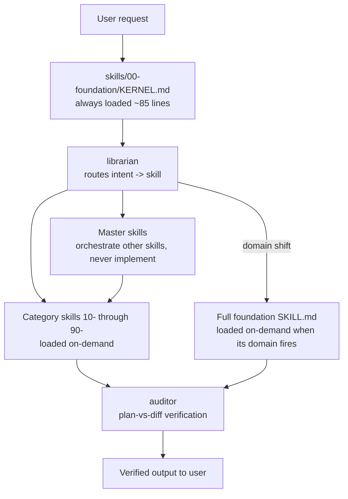

# Agent Skills Garden 🌱

> *A hierarchical, constitution-driven skill library that serves as the "brain" for AI agents.*
>
> *88 skills across domain namespaces (foundation + engineering, designed to scale to thousands) — these hierarchical skills enable any model to reason as well as the best frontier models.*

[](LICENSE)

Skills are markdown files with YAML frontmatter. **The frontmatter is the single source of truth** — the build walks `skills/` and generates a *tiered discovery index* (and a back-compat `registry.yaml`) from it, so an agent finds the right skill among hundreds or thousands while loading near-constant tokens. Skills are organised into top-level **domains** (`000-foundation`, `100-engineering`, and room to grow into writing, data-ml, business, …). Every action is governed by a **Constitution** rooted in four principles:

| Pillar | Sanskrit | Meaning |
|--------|----------|---------|
| **Truth** | Satya | Deterministic, reproducible outputs. No hallucinations. |
| **Safety** | Dharma | Ask-first policy. Prefer the smallest change. |
| **Non-Destruction** | Ahimsa | Preview diffs before applying. Always reversible. |
| **Wisdom** | Pragya | Direction-seeking. Present options, never assume. |

Inspired by the [Agent Skills](https://agentskills.io/) open format.

Alongside the Constitution, the **[Pragmatism (Aparigraha)](#pragmatism-25--aparigraha-)** category gives the garden its bias for *real, ongoing business projects*: the agent *checks* before creating, *conforms* within the scope of the change, stays *surgical*, and *validates edge cases* before trusting any reuse or improvement of existing code. Direction-of-thought, not rigid rule.

For an industry-vocabulary map of these ideas (YAGNI, Strangler Fig, Boy Scout Rule, Chesterton's Fence, …) into the garden's pragmatism skills, see [docs/named-principles.md](docs/named-principles.md).

---

## Quick Start

The supported install path is the **bridge-link** workflow described below — one
Windows junction (or POSIX symlink) makes the garden's `skills/` folder live-visible
inside any consumer repo, with no copy step.

> **Looking for the old `setup_skills.sh` / `setup_skills.ps1` installers?**
> They have been moved to [`legacy/`](legacy/) and are preserved for historical
> reference only. They are significantly out of sync with the current 88-skill
> hierarchical layout and will not be regenerated. See [`legacy/README.md`](legacy/README.md).

---

## Use in Other Repos (Bridge Link)

Treat this garden as a **single source of truth** for every other repo on your
machine. A single Windows junction makes the `skills/` folder live-visible at a
conventional path (`.claude/skills`, `.cursor/skills`, `.github/skills`, or
`skills`) inside any consumer repo. Edit or `git pull` here once — all
consumer repos see the change immediately. No copies, no sync step.

Two scripts do the work:

1. **`install-garden.ps1`** — run **once per machine**. Clones the garden into a
   predictable, fork-safe path and remembers where it is.
2. **`link-skills.ps1`** — run **once per consumer repo**. Creates the live
   junction inside that repo.

Both are safe by default: they print a **plan** of every action they're about to
take and wait for `y/N` confirmation. Pass `-Yes` to skip the prompt for
unattended runs (CI, scripting). Pass `-Help`, `-h`, `--help`, or `/?` for the
short usage block; `-?` or `Get-Help -Detailed` for the full PowerShell help.

### Help flags (both scripts accept all of these)

| Flag | What you get |
|------|--------------|
| `-h`, `--help`, `-Help`, `/?` | Short, human-friendly usage block |
| `-?` | Full comment-based help (PowerShell native, longer) |
| `Get-Help .\<script>.ps1 -Detailed` | Full reference incl. all parameters, notes, examples |
| `Get-Help .\<script>.ps1 -Examples` | Just the examples |
| `Get-Help .\<script>.ps1 -Full` | Everything |

### First-machine setup (one time)

```powershell
iwr https://raw.githubusercontent.com/dhruvinrsoni/agentskills-garden/main/scripts/install-garden.ps1 | iex
```

You will be asked which agent convention you mostly use (`cursor` / `claude` /
`github` / `generic`) — the answer is persisted as `agentskills.defaultTarget`
in `~/.gitconfig` and reused by `link-skills.ps1` as its default. The script
then prints a plan, waits for `y/N`, and on confirm clones the garden into
`<root>\github\<gh-user>\agentskills-garden`.

For unattended setup (e.g. provisioning):

```powershell
.\install-garden.ps1 -GhUser yourname -AddToPath -Yes
```

### Per consumer repo

Run inside the repo:

```powershell
# Interactive: auto-detects .claude/ / .cursor/ / .github/ in $PWD,
# shows a menu with the detected one highlighted, prints a plan, asks y/N.
& "<garden>\scripts\link-skills.ps1"

# Skip the menu by naming a target explicitly:
& "<garden>\scripts\link-skills.ps1" -Target claude       # .claude/skills
& "<garden>\scripts\link-skills.ps1" -Target cursor       # .cursor/skills
& "<garden>\scripts\link-skills.ps1" -Target github       # .github/skills
& "<garden>\scripts\link-skills.ps1" -Target generic      # skills
& "<garden>\scripts\link-skills.ps1" -Target custom -LinkPath ".agent/skills"

# Skip BOTH the menu and the confirm prompt (CI / scripting):
& "<garden>\scripts\link-skills.ps1" -Target claude -Yes

# Inspect / remove
& "<garden>\scripts\link-skills.ps1" -Status
& "<garden>\scripts\link-skills.ps1" -Unlink
```

If you ran `install-garden.ps1 -AddToPath`, drop the `& "<garden>\scripts\"`
prefix and just type `link-skills.ps1 ...`.

### Quick reference cheat-sheet

```
# one-time, per machine
install-garden.ps1 -GhUser <you> -AddToPath

# every consumer repo
link-skills.ps1                 # interactive
link-skills.ps1 -Status         # what is currently linked here?
link-skills.ps1 -Unlink         # remove the link
link-skills.ps1 -Help           # short usage; -? for full
```

Background, design decisions, and troubleshooting notes live in
[docs/skills-bridge.md](docs/skills-bridge.md). A linear walk-through for first-time
users is in [docs/getting-started.md](docs/getting-started.md).

---

## How it works



**The runtime in plain English.** Every turn loads exactly one file from the foundation: [`KERNEL.md`](skills/000-foundation/KERNEL.md). It contains the 1-2 paragraph kernel of every foundation skill — the rules the agent cannot operate without. The full `SKILL.md` body of each foundation skill loads only when its domain actually fires (a real direction checkpoint, a real audit, a real domain shift). The librarian routes the user's intent to the right category skill or master skill. Master skills orchestrate other skills as named workflows. The `auditor` runs last and blocks delivery on misalignment.

### What's loaded when

| Path | Loaded when | Token cost |
|------|-------------|------------|
| [`skills/00-foundation/KERNEL.md`](skills/000-foundation/KERNEL.md) | Every turn | Always paid (~85 lines) |
| Full foundation `SKILL.md` (e.g. [`pragya`](skills/000-foundation/pragya/SKILL.md)) | Domain trigger fires (real checkpoint, real audit, real domain shift) | Paid only when needed |
| Category skills [`10-`](skills/100-engineering/10-discovery) through [`90-`](skills/100-engineering/90-maintenance) | Librarian routes to them | Paid only when invoked |
| Master skills (anywhere with `skill_type: master`) | User asks for the named workflow | Paid only when invoked |

---

## Concepts at a glance

| Document | What it explains |
|----------|------------------|
| [`docs/how-it-works.md`](docs/how-it-works.md) | **Start here.** 2-minute plain-words model: what a skill is, where skills live, how one is found, how to add or share one. |
| [`docs/scripts.md`](docs/scripts.md) | Cheat-sheet — every script and the one thing you run it for. |
| [`docs/concepts.md`](docs/concepts.md) | The four-level hierarchy (nano → micro → skill → master), the `**Nano:**` marker, Eco 🌿 / Power ⚡ tags, the `reasoning_mode` frontmatter values, and what "always loaded" actually means. |
| [`docs/tags.md`](docs/tags.md) | The five-axis tag taxonomy (`scope`, `lifecycle`, `capability`, `stack`, `risk`), the top-level **domain** namespaces, and the v2 frontmatter fields every `SKILL.md` declares. |
| [`docs/master-skills.md`](docs/master-skills.md) | Authoring guide for master skills — the hard rules, micro-skill anatomy, branching, parallel invocation, and how masters interact with the auditor. |
| [`docs/skills-bridge.md`](docs/skills-bridge.md) | Design notes for the live bridge-link distribution mechanism. |

New here? Read `how-it-works.md` first, then this README — that's the complete mental model.

---

## Repository Structure

```
agentskills-garden/
├── registry.yaml                            # GENERATED back-compat index (do not edit)
├── registry.json                            # GENERATED machine mirror
├── README.md                                # This file
├── skills/
│   ├── _index/                              # GENERATED discovery index (map→domain→category→skill)
│   │   ├── MAP.md                           #   the map — domains only (always-load, tiny)
│   │   ├── foundation/INDEX.md              #   domain index — flat domain: lists skills
│   │   ├── engineering/INDEX.md             #   domain index — lists categories
│   │   ├── engineering/30-implementation.md #   category index — lists skills
│   │   └── index.json                       #   flat machine mirror
│   ├── 000-foundation/      (8 skills + KERNEL.md)   # domain: foundation (flat, universal)
│   │   ├── KERNEL.md                        # The always-loaded aggregator
│   │   └── constitution/SKILL.md            # Each skill is a directory + SKILL.md
│   └── 100-engineering/                     # domain: engineering (NN-phase folders inside)
│       ├── 10-discovery/    (3 skills)      # Requirements, domain modeling, PRD
│       ├── 20-architecture/ (7 skills)      # System, API, DB, ADR, scorer, schema, pipeline
│       ├── 20-planning/     (4 skills)      # Task decomposition, risk, dependencies, estimation
│       ├── 25-pragmatism/   (6 + 1 master)  # Aparigraha — check, conform, surgical, validate
│       ├── 30-implementation/ (9 + 2 masters)# Code gen, refactoring, TDD, cleanup, resilience
│       ├── 40-quality/      (9 + 1 master)  # Reviews, testing strategies, mutation, two-pass
│       ├── 50-documentation/ (4 skills)     # API docs, ADRs, changelogs, inline
│       ├── 50-performance/  (5 skills)      # Caching, DB tuning, profiling, progressive, resources
│       ├── 60-debugging/    (3 skills)      # Root cause, log analysis, error handling
│       ├── 60-security/     (4 skills)      # Auth, threat modeling, secure coding, dep scanning
│       ├── 70-devops/       (5 + 1 master)  # CI/CD, Docker, K8s, Terraform, monitoring
│       ├── 80-collaboration/ (4 skills)     # Git workflow, PRs, pair programming, knowledge
│       ├── 80-docs/         (3 skills)      # OpenAPI, README, release notes
│       └── 90-maintenance/  (7 + 1 master)  # Incidents, migrations, tech debt, deprecation
│   (future domains: 200-writing/, 300-data-ml/, 400-business/, …)
├── templates/
│   └── skill-template.md                    # Boilerplate for new skills (incl. master variant)
├── scripts/
│   ├── build.py                        # Run to build site + generate index/registry (--serve previews)
│   ├── validate.py                     # Run to validate skill frontmatter (--strict = v2)
│   ├── benchmark.py                     # Run to prove lookup cost stays flat at 1000s of skills
│   ├── migrate.py                      # One-shot: v1 → domain-namespace migration
│   ├── taxonomy.py                     # Library: tag axes + domain allowlist (imported)
│   ├── skill_lib.py                    # Library: shared parse/validate/tree-walk (imported)
│   ├── link-skills.ps1                      # Per-consumer bridge-link (download direction)
│   ├── install-garden.ps1                     # First-machine clone + git config setup
│   ├── promote-skills.ps1                          # Push a repo's ready drafts up into the garden
│   ├── gather-skills.ps1                    # Garden-side bulk-pull ready drafts from all repos
│   └── _common.ps1              # Shared helpers for the promotion scripts
├── docs/
│   ├── how-it-works.md                      # START HERE — 2-min plain-words mental model
│   ├── scripts.md                           # Cheat-sheet: every script, one line
│   ├── concepts.md                          # Hierarchy, nano, Eco/Power, reasoning_mode, kernel
│   ├── tags.md                              # Five-axis tags + domain namespaces + v2 fields
│   ├── master-skills.md                     # Master-skill authoring guide
│   └── skills-bridge.md                     # Bridge-link + promotion-flow design notes
└── legacy/                                  # Deprecated installers, kept for history
```

**Total: 89 skills (across the foundation + engineering domains, incl. 6 masters) + 1 template; index & registry are generated**

> 6 of the 88 entries are **master skills** (`skill_type: master`): `aparigraha-task`, `feature-shipping`, `refactoring-workflow`, `pr-review-flow`, `release-pipeline`, `incident-response-flow`. They live under their natural categories and are marked by the `master` scope tag.

---

## Skill Format (SKILL.md)

Every skill follows the [agentskills.io specification](https://agentskills.io/specification). Each skill is a **directory** named after the skill, containing a `SKILL.md` file:

```
skills/<category>/<skill-name>/
└── SKILL.md
```

Frontmatter schema:

```yaml
---
name: cleanup                    # required: lowercase alphanumeric + hyphens, max 64 chars
description: >                   # required: 1-1024 chars, what it does + when to use it
  Remove noise, enforce formatting, and safely rename identifiers.
license: Apache-2.0              # required: must be exactly Apache-2.0
compatibility: Designed for Claude Code and compatible AI agent environments
domain: engineering              # required: top-level namespace (foundation|engineering|writing|…)
tags: [category, build, refactoring, reversible]  # required: five-axis tags (see docs/tags.md)
keywords: [tidy, format, lint, dead-code]         # required (may be []): search synonyms
status: published                # required: draft|ready|published|deprecated
metadata:
  version: "1.0.0"
  dependencies: "constitution, scratchpad, auditor"
  reasoning_mode: mixed          # linear | plan-execute | tdd | mixed
  skill_type: standard           # standard | master  (master = orchestration only)
---
```

`tags` now live in frontmatter (not `registry.yaml`). The five axes are `scope`,
`lifecycle`, `capability`, `stack`, `risk` — see [`docs/tags.md`](docs/tags.md).
`domain` is validated against an allowlist (`REGISTERED_DOMAINS` in
[`scripts/taxonomy.py`](scripts/taxonomy.py)); extend it to add a domain.

Foundation skills additionally carry a `## Kernel` section at the top — the 1-2 paragraph essential rules that get aggregated into [`skills/00-foundation/KERNEL.md`](skills/000-foundation/KERNEL.md). The rest of each foundation `SKILL.md` body is loaded on demand.

The markdown body uses progressive disclosure:

| Section | Purpose |
|---------|---------|
| **Kernel** *(foundation only)* | The 1-2 paragraph essence quoted into KERNEL.md |
| **Context** | When and why to invoke this skill |
| **Micro-Skills** | Ordered sub-tasks with Eco 🌿 / Power ⚡ mode tags (and `**Invokes:**` for masters) |
| **Inputs / Outputs** | Typed parameters and return artifacts |
| **Scope** | Explicit in-scope / out-of-scope boundaries |
| **Guardrails** | Hard constraints that must never be violated |
| **Ask-When-Ambiguous** | Triggers + question templates for uncertain situations |
| **Decision Criteria** | Situation → Action lookup table |
| **Success Criteria** | Verifiable checklist for "done" |
| **Failure Modes** | Known failure patterns with symptoms and mitigations |
| **Audit Log** | Structured log entry templates for traceability |
| **Examples** | Concrete before/after demonstrations |
| **Edge Cases** | Unusual inputs and how to handle them |

See [`docs/concepts.md`](docs/concepts.md) for the full hierarchy and [`docs/master-skills.md`](docs/master-skills.md) for the master variant.

---

## Skill Categories

### Foundation (00) — Always Loaded First

| Skill | Purpose |
|-------|---------|
| **constitution** | Four pillars (Satya, Dharma, Ahimsa, Pragya) + amendment mechanism |
| **scratchpad** | Private `<scratchpad>` reasoning, Eco vs Power mode selection, 4-step reasoning |
| **auditor** | Plan↔Diff alignment, protected-terms enforcement, constitutional compliance |
| **librarian** | Six-tier waterfall routing (EXACT → PREFIX → SUBSTRING → TAG → SEMANTIC → NONE) |
| **pragya** | Direction-seeking — never assume on uncertain or irreversible actions |
| **orchestrator** | Mid-task skill injection on detected domain shift |
| **token-efficiency** | Resource-aware tier/tool/delegation selection per cognitive mode |
| **pragmatism** | Aparigraha — non-accumulation. The driving force for real, ongoing business projects |

These are loaded **before every task**. Only the kernel of each (1-2 paragraphs) is always paid for; full bodies load on demand.

### Discovery (10)

| Skill | Purpose |
|-------|---------|
| **requirements-elicitation** | Structured interviewing, functional/non-functional capture |
| **domain-modeling** | Entity extraction, glossary, Protected Terms, ER diagrams |
| **prd** | Lean / full / working-backwards / hypothesis PRD authoring with lifecycle |

### Architecture (20)

| Skill | Purpose |
|-------|---------|
| **system-design** | Component decomposition, scalability patterns, trade-off matrices |
| **api-contract-design** | Contract-first design, OpenAPI/SDL schemas, versioning |
| **database-design** | Schema normalization, indexing, migration scripts |
| **adr-management** | ADR lifecycle (Proposed → Accepted → Deprecated → Superseded) |
| **scorer-pipeline** | Composable evaluation — independent micro-scorers with explicit weights |
| **schema-driven-config** | Single schema for defaults + validation + storage + UI |
| **pipeline-context** | Pre-compute once, share via context object across pipeline stages |

### Planning (20)

| Skill | Purpose |
|-------|---------|
| **task-decomposition** | Work breakdown, DAG ordering, T-shirt sizing |
| **risk-assessment** | 5×5 probability/impact matrix, mitigation strategies |
| **dependency-analysis** | Dependency graphs, circular detection, staleness/CVE audit |
| **estimation** | Three-point (PERT) estimation, relative sizing, confidence intervals |

### Pragmatism (25) — Aparigraha (अपरिग्रह)

> *Direction-of-thought, not rigid rule.* The agent *checks* before creating, *conforms* within scope, stays *surgical*, and *validates edge cases* before trusting any reuse or improvement of existing code. Built for real, ongoing business projects where the goal is *maximum output, minimum effort, zero maintenance, maximum continuity with what's already there* — not greenfield ideals. **Checking is mandatory; reusing is conditional.**

| Skill | Purpose |
|-------|---------|
| **reuse-first** | Scan codebase + dependencies before authoring new helpers; reuse only after edge-case validation |
| **dependency-utility-scout** | Per-capability inventory of utilities the project already imports — advisory |
| **style-conformance** | Detect existing conventions; produce a house-style profile downstream skills consult — awareness, not enforcement |
| **minimal-diff** | Smallest correct change. Diff-size caps, drive-by detection, reversibility checks |
| **chesterton-fence** | Investigate intent before deleting/refactoring "weird" code; produce memo + edge-case checklist |
| **brownfield-onboarding** | First-touch protocol — manifests, build/test/CI commands, hot zones, entry points |
| **aparigraha-task** ⭐ *master* | Walks the four Aparigraha gates end-to-end: onboarding → inventory → style → reuse decision → minimal diff → audit |

Paired with the always-loaded foundation skill `pragmatism`, which codifies the four directional principles (*check-before-create*, *conform-before-improve*, *surgical-before-sweeping*, *validate-before-trust*) and the cross-cutting edge-case validation clause.

### Implementation (30)

| Skill | Purpose |
|-------|---------|
| **code-generation** | Template expansion, language idiom enforcement, DRY deduplication |
| **refactoring** | Safe restructuring with test → refactor → test → revert protocol |
| **refactoring-suite** | Comprehensive refactoring patterns (extract, inline, rename) |
| **tdd-workflow** | Red-Green-Refactor cycle, test-first, coverage targets |
| **cleanup** | Dead code removal, formatting, linting, import optimization |
| **api-implementation** | REST/GraphQL endpoint implementation, middleware |
| **data-access** | ORM patterns, repository pattern, query optimization, N+1 prevention |
| **error-handling** | Exception hierarchies, retry strategies, response formats |
| **resilience-patterns** | Circuit breaker, retry-with-backoff, bulkhead, fallback chains, timeouts |
| **feature-shipping** ⭐ *master* | PRD → task-decomposition → tdd-workflow → code-review → release-pipeline → audit |
| **refactoring-workflow** ⭐ *master* | Ladder at four named depths (cosmetic / micro / meso / architectural); always runs chesterton-fence + style-conformance + characterisation tests |

### Quality (40)

| Skill | Purpose |
|-------|---------|
| **code-review** | Review checklists, defect categories, severity classification |
| **test-strategy** | Test pyramid, framework selection, threshold negotiation |
| **testing-strategy** | Coverage analysis, test type selection, boundary conditions |
| **unit-testing** | AAA pattern, mock boundaries, edge-case coverage |
| **integration-testing** | Docker lifecycle, API/DB isolation, seed data versioning |
| **mutation-testing** | Mutant classification, equivalent mutant handling, score thresholds |
| **security-review** | OWASP Top 10, vulnerability scanning, secret detection |
| **performance-review** | Bottleneck identification, complexity analysis, caching review |
| **two-pass-analysis** | Separate Pass 1 (collect metrics) from Pass 2 (gate the build) |
| **pr-review-flow** ⭐ *master* | code-review + security-review + performance-review in parallel → aggregated decision → pr-management → audit |

### Documentation (50)

| Skill | Purpose |
|-------|---------|
| **api-documentation** | Endpoint docs, OpenAPI specs, request/response examples |
| **inline-documentation** | JSDoc/docstrings, comment quality, self-documenting code |
| **decision-records** | ADR authoring (context → decision → consequences) |
| **changelog-generation** | Conventional commits parsing, semantic versioning |

### Performance (50)

| Skill | Purpose |
|-------|---------|
| **profiling-analysis** | CPU/memory profiling, flame graphs, hotspot identification |
| **caching-strategy** | Cache design, TTL, invalidation, cache-aside/write-through |
| **db-tuning** | Query optimization, explain plans, index recommendations |
| **progressive-execution** | Fast approximate (Phase 1) then slow enriched (Phase 2) results |
| **resource-awareness** | Monitor constraints (memory, CPU, time, rate limits), adapt gracefully |

### Debugging (60)

| Skill | Purpose |
|-------|---------|
| **root-cause-analysis** | 5-whys, fault trees, git bisection, symptom-to-cause mapping |
| **log-analysis** | Log parsing, pattern recognition, event correlation, anomaly detection |
| **error-handling-debug** | Exception hierarchies, retry strategies, graceful degradation |

### Security (60)

| Skill | Purpose |
|-------|---------|
| **threat-modeling** | STRIDE, attack surfaces, trust boundaries |
| **secure-coding-review** | Secure coding practices, OWASP, input validation |
| **auth-implementation** | Authentication/authorization, JWT, OAuth, RBAC |
| **dependency-scanning** | CVE scanning, SBOM generation, supply-chain security |

### DevOps (70)

| Skill | Purpose |
|-------|---------|
| **ci-pipeline** | Pipeline design, stage orchestration, deployment gates |
| **docker-containerization** | Dockerfile best practices, multi-stage builds, image optimization |
| **kubernetes-helm** | K8s manifests, Helm charts, resource limits, non-root |
| **terraform-iac** | Infrastructure as code, state management, drift detection |
| **monitoring-setup** | Observability pillars, SLIs/SLOs, alerting, distributed tracing |
| **release-pipeline** ⭐ *master* | test-strategy → changelog-generation → ci-pipeline → audit |

### Collaboration (80)

| Skill | Purpose |
|-------|---------|
| **git-workflow** | Branching strategies, commit conventions, conflict resolution |
| **pr-management** | PR templates, review assignments, merge criteria |
| **pair-programming** | Driver/navigator roles, mob programming, knowledge transfer |
| **knowledge-sharing** | Documentation culture, wikis, runbooks, onboarding guides |

### Docs (80)

| Skill | Purpose |
|-------|---------|
| **openapi-specs** | OpenAPI spec generation and validation |
| **readme-generation** | README writing, badge generation, section management |
| **release-notes** | Release-note generation from commit history |

### Maintenance (90)

| Skill | Purpose |
|-------|---------|
| **incident-response** | Triage, mitigation, postmortems, SLA tracking |
| **legacy-upgrade** | Modernisation, strangler fig pattern, codemods |
| **dependency-updates** | Automated updates, semver compatibility, lockfile management |
| **deprecation-management** | Sunset timelines, migration paths, consumer impact |
| **migration-planning** | Version upgrades, data migration, rollback strategies |
| **tech-debt-tracking** | Debt categorisation, impact scoring, payoff prioritisation |
| **repo-maintenance** | Adaptive cleanup framework — start simple, discover value, pivot toward greater good |
| **incident-response-flow** ⭐ *master* | incident-response (mitigate first) → root-cause-analysis → log-analysis → decision-records → audit |

---

## Eco vs Power Mode

```text
if task.changes_logic == false && task.files <= 2:
    mode = "eco"     # 🌿 Simple linear plan (1-3 steps)
else:
    mode = "power"   # ⚡ 4-Step Reasoning: Deductive → Inductive → Abductive → Analogical
```

When in doubt, default to **Power Mode**. See [`docs/concepts.md`](docs/concepts.md) for the full mode-selection heuristic and how individual micro-skills tag their mode independently.

---

## Creating a New Skill

1. Create a directory under the right domain: `skills/100-engineering/<NN-phase>/<skill-name>/` (or `skills/000-foundation/<skill-name>/` for a universal skill). `<skill-name>` is lowercase with hyphens and must match the `name` frontmatter exactly.
2. Copy `templates/skill-template.md` into that directory as `SKILL.md`.
3. Fill in the YAML frontmatter (full schema under [Skill Format](#skill-format-skillmd)) — including `domain`, `tags`, `keywords`, and `status`:
   ```yaml
   name: skill-name
   description: What it does and when to use it (1-1024 chars).
   license: Apache-2.0
   domain: engineering
   tags: [category, build, coding, reversible]
   keywords: [synonyms, for, search]
   status: published
   metadata:
     version: "0.1.0"
     dependencies: "constitution, scratchpad"
     reasoning_mode: linear         # linear | plan-execute | tdd | mixed
     skill_type: standard           # use 'master' for orchestration-only skills
   ```
4. Write the markdown body following the section list under [Skill Format](#skill-format-skillmd). For master skills, additionally follow the hard rules in [`docs/master-skills.md`](docs/master-skills.md).
5. **No registry edit needed** — frontmatter is the source of truth. Run `python scripts/validate.py --strict` to check it, then `python scripts/build.py` to regenerate the index + `registry.yaml`. The Librarian auto-discovers it via the tiered index.

> **Drafting in another repo?** Author the skill under that repo's
> `.agentskills/drafts/<name>/SKILL.md` with `status: draft`, flip to
> `status: ready` when done, and run [`scripts/promote-skills.ps1`](scripts/promote-skills.ps1)
> (or [`scripts/gather-skills.ps1`](scripts/gather-skills.ps1) from the garden)
> to push it up. See [`docs/skills-bridge.md`](docs/skills-bridge.md) §9.

---

## License

[Apache License 2.0](LICENSE)
